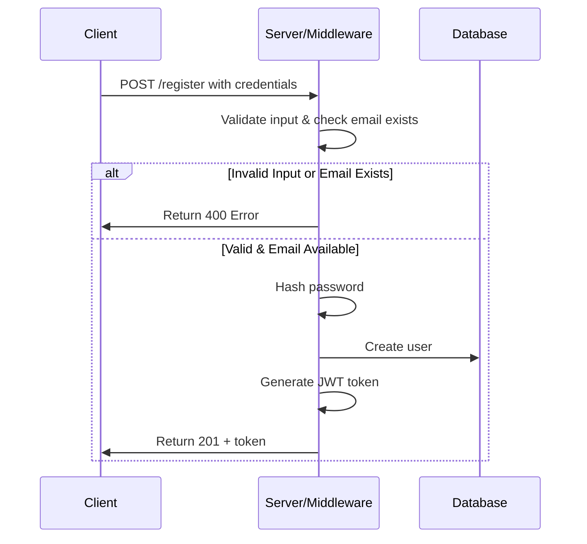
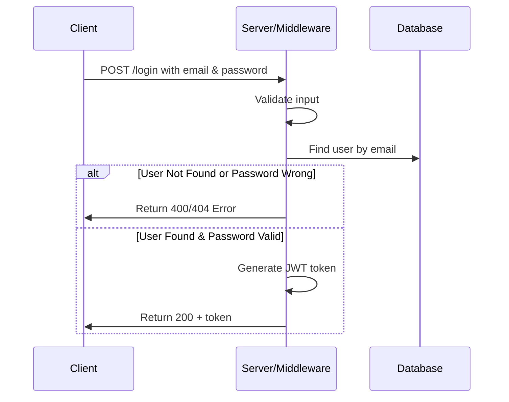

# Authentication Flows - Sequence Diagrams

## Register Flow Diagram

## Login Flow Diagram

## Summary

### Register Flow

- Validates input (name, email, password confirmation, role)
- Checks if email already exists
- Hashes password using bcrypt
- Creates new user document in database
- Generates JWT token (valid for 7 days)
- Returns user data and token

### Login Flow

- Validates email and password presence
- Queries database for user by email
- Compares provided password with stored hash using bcrypt
- Generates JWT token (valid for 7 days)
- Returns user ID, role, and token
